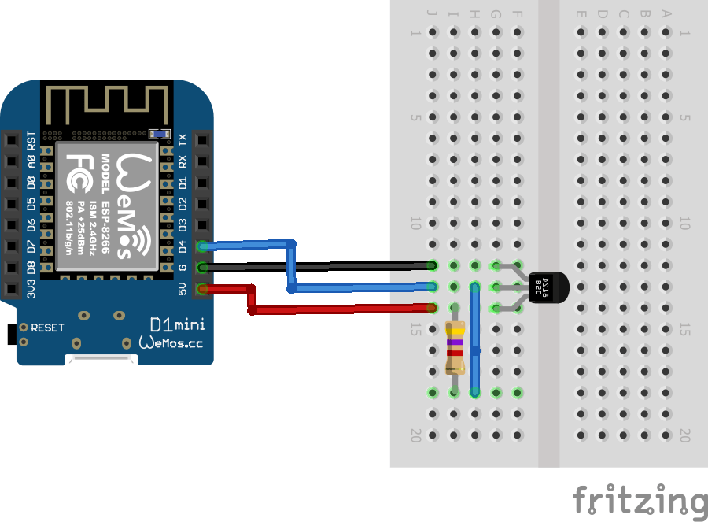

# iot-temperature-sensor
 
This is an example of an IOT With Wemos D1 mini. It measure a temperature with a DS18B20 sensor and send it to OVH metrics

## Schema

## Compile

You need to:

1. Install Arduino
2. Install ESP8266 support (file->preferences; set URL to http://arduino.esp8266.com/stable/package_esp8266com_index.json and then install card **ESP8266**)
3. Install library **OneWire**
4. Copy file `config.h.sample` to `config.h` and set values in it

